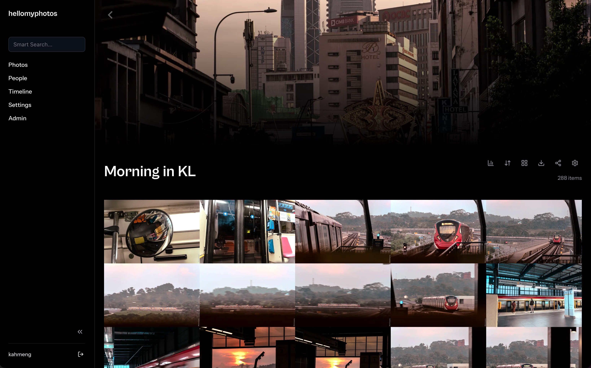

# hellomyphotos 📸

A beautiful, self-hosted, directory-first photo management gallery engine. It reads directly from your existing disk folder hierarchies without moving or duplicating files, bringing Google Photos-like speed and AI capabilities to your local storage.



---

## 🌟 Key Features

- **Directory-First Engine**: Leave your folders exactly as they are. hellomyphotos scans your media on-demand without modifying original files.
- **High Performance**: Optimized virtualized grid capable of smoothly rendering thousands of thumbnails.
- **AI Facial Recognition**: Powered by Immich ML, automatically clusters and organizes your photos by person using `pgvector`.
- **Dynamic Watermarking**: Create secure, expiring public share links with on-the-fly watermarking.
- **Low-Bandwidth Mode**: Switch to 480p delivery for mobile data savings.
- **Robust Tech Stack**: Built with SvelteKit, Fastify, PostgreSQL + pgvector, and Redis.

---

## 🚀 Quick Start — Docker Compose

The simplest way to run hellomyphotos is with Docker Compose. It runs the full stack: frontend, backend API + workers, PostgreSQL (pgvector), Redis, and the Immich ML engine.

### 1. Prerequisites
- **Docker** and **Docker Compose** (with buildx for local builds)

### 2. Clone the repository
```bash
git clone https://github.com/KahMeng15/hellomyphotos.git
cd hellomyphotos
```

### 3. Configure the environment
```bash
cp .env.example .env
```
Edit `.env` and at minimum set:
- `APP_DOMAIN` / `PUBLIC_APP_DOMAIN` — the URL you use to reach the app (e.g. `http://localhost:8000` locally, `https://photos.mydomain.com` in production).
- `DB_PASS` / `POSTGRES_PASSWORD` — change the default database password.
- `JWT_SECRET` and `COOKIE_SECRET` — add long random strings (not in the example, but strongly recommended).
- `TURNSTILE_SITEKEY` / `TURNSTILE_SECRET` — your Cloudflare Turnstile pair (the defaults are Cloudflare's *always-pass* test keys). The site key is served to the frontend at runtime, so no key is baked into any image.

### 4. Add your photos
The scanner reads directly from `./volumes/media_ro` (mounted read-only — your originals are never modified).
```bash
mkdir -p volumes/media_ro/test_folder
# Add some .jpg, .png, or .mp4 files here!
```

### 5. Start the stack
Pull the prebuilt multi-arch images from GitHub Container Registry and start:
```bash
docker compose up -d
```
> The images (`ghcr.io/kahmeng15/hellomyphotos/frontend:latest` and `backend:latest`) are multi-arch (linux/amd64 + linux/arm64), so they run natively on both Intel and Apple Silicon Macs, and on ARM servers.

**Or build from source** (uses your local code instead of published images):
```bash
docker compose up -d --build
```

On first boot, PostgreSQL initializes the schema and seeds the default admin account from `volumes/pg_init`. Give it ~30 seconds before visiting the UI.

### 6. Access the application
| Service | URL |
| --- | --- |
| Frontend UI | http://localhost:8000 |
| Redis (diagnostics) | http://localhost:8003 |
| Immich ML (health) | http://localhost:8004 |

The backend API is **not** exposed to the host. The frontend proxies all `/api/*` calls to it internally.

### 7. Update / stop / teardown
```bash
# Pull the latest images and recreate changed containers
docker compose pull && docker compose up -d

# Stop all containers (data is preserved)
docker compose down

# Stop AND delete all volumes (postgres data, cache, redis) — full reset
docker compose down -v
```

---

## 🧱 Services & Data Locations

| Container | Image / Role | Host port |
| --- | --- | --- |
| `frontend` | SvelteKit node server (serves the UI + proxies `/api`) | `8000` |
| `backend` | Fastify API, auth, streaming, queue dispatch | internal |
| `backend-worker` | BullMQ background workers (thumbnails, ffmpeg, ML, clustering) | internal |
| `postgres` | `ankane/pgvector` — metadata, embeddings, shares, analytics | internal |
| `redis` | BullMQ + caching + analytics buffer | `8003` |
| `machine-learning` | Immich ML — face detection + CLIP embeddings | `8004` |

Persistent data lives under `./volumes/`:
- `media_ro/` — your photos (read-only mount; add files here to be scanned)
- `cache_rw/` — generated thumbnails / transcoded videos (safe to delete; rebuilt on rescan)
- `pg_data/` — PostgreSQL data (**back this up**)
- `redis_data/` — Redis persistence
- `ml_cache/` — ML model weights (downloaded on first use)
- `pg_init/` — SQL run automatically on first DB initialization

---

## 🔐 Default Credentials

A default administrator account is seeded on first start:

- **Email:** `admin@example.com`
- **Password:** `admin`

> **Note:** Please change this password immediately after your first login!

---

## 📚 Documentation

- **[Technical Documentation](tech_docs.md)** — architecture, database schema, background worker system, API details, deployment & security checklists.
- **[Local Development Guide](tech_docs.md#7-local-development-guide)** — hot-reloading dev stack and non-Docker local development.
